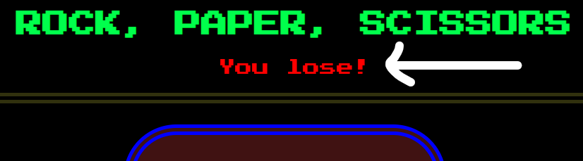
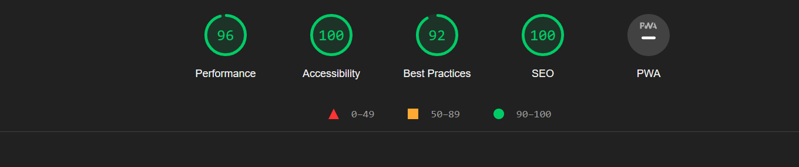

# Rock Paper Scissors #

* The Rock Paper Scissors game is a hand gensture game played between two people where the rock is a clench fist; paper is a hand raised open palm gensture, but in horizontal position with fingers and thumb extended and the palm facing downward; and scissors is a fist with the index and middle fingers fully extended toward the opposing player. In this game the possibilities are Rock wins against scissors; Paper wins against Rock; and Scissors wins against paper.

* This game aims to teach the players rules of Rock Paper Scissors, it makes you a mentally active individual.
You could predict or read a possible outcome in your decision making, planning and mind control. The Rock Paper Scissors can be used in deciding between the participants for a task e.g, like who goes first in starting a game of football. This game offers simplicity in practice, and game play as it can be played by adults and kids, it is enjoyable and relaxing with the fun that comes with it.

## Features
_______________________________

### Header

*  At the top of the page, the header shows the name of the game: Rock Paper Scissors with a suitable well contrasted font that is very projecting.

* The header shows the player the name of the game.

### Result Display 
* The Result Area is between the Header and the selection pane. 

* This space is for the results which indicates who loses or wins a current game.

* And also indicates the overall winner after ten game play.
	

### Object Selection section.

* This section consits of three different buttons with each button representing the object: The first button represents the Rock , the second button represents the Paper and the third button represnts the Scissors.

### Game Play Section

* Whenever any of the buttons are clicked, it indicates in the game play area what the player clicked. 

* The computer will randomly choose an option which will also indicat the object the computer picks.

* And the result of the winner of the current game is shown.

## Score Counter Section

* This Indicates the game score for each player , User score display at the left and computer score display at the right. 

* There is an increament each time the user wins and an increament on the computer score board each time the player lose.

## Footer Section
	
* The section consists of the rules of the game.

## Testing

* This game was played  and  tested by me on various browsers: Firefox,Safari,Chrome,Edge and works perfectly on all of this browsers.

* I confirm that this game works fine with accurate results on all standard screen sizes.

* I confirm that all fonts and images on each section of the page is readable on all tested screens: the header, buttons, footer.

## Tools used

* HTML : For the webpage and schemantic structure [HTML](https://www.w3schools.com/html/ "w3schools")

* CSS: For styling and how the page should display [CSS](https://www.w3schools.com/css/ "w3schools")

* JAVASCRIPT: It makes the website interactive and user responsive [Javascript](https://www.w3schools.com/js/ "w3schools")

## Bugs
* No bugs was found.

## Validator Testing.

* HTML
	* The codes were tested on W3C Validator and no error was found [W3C HTML Validator](https://validator.w3.org/nu/#textarea "W3C HTML Validator").

* CSS
	* The codes were tested on Jigsaw Css Validator and no error was found [W3C CSS Validator](https://jigsaw.w3.org/css-validator/validator#css "W3C CSS Validator") 
	.

* JavaScript
	* The codes were tested on Jshint Javascript  Validator and no error was found [Jshint Javascript Validator](https://jshint.com/ "jshint javascript Validator")
	..

* Accessibility
	 * To meet the accessibility requirment, an easy to read fonts and colors are chosen, and was tested through lighthouse report in devtools.

.

## unfixed Bugs
* image aspect ratio calibration error from the lighthouse report, which shall be fixed later.

## Deployment

* The page was deployed to Github Pages by following this steps.

* In the Github repository, navigate to the settings tab.

* From the source section drop-down menu,select the master branch.

* Once the master branch has been selected, The page provides the link to the completed website.

* The Live link can be found here [Rock Paper Scissors](https://gullah26.github.io/Rock_Paper_Scissors/ "rock paper scissors").

## Credits

* Content

	* The part of the code to make the function check winner was from  [sebhastian](https://sebhastian.com/rock-paper-scissors-javascript/ "sebhastian")

	* The inspiration to start  the project is from  Code Institute Portfolio Project Scope.

## Media

* The Images used on this game  was taken from [png set](https://pngset.com/download-free-png-yiceg "png set").
